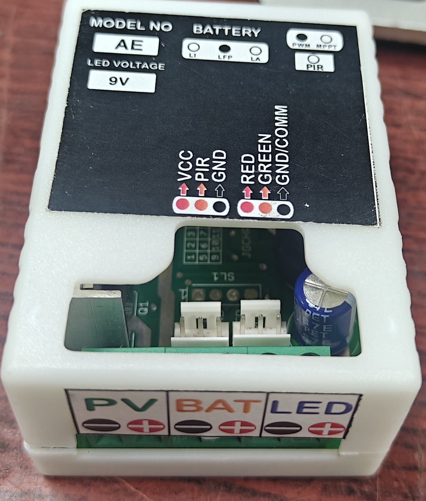
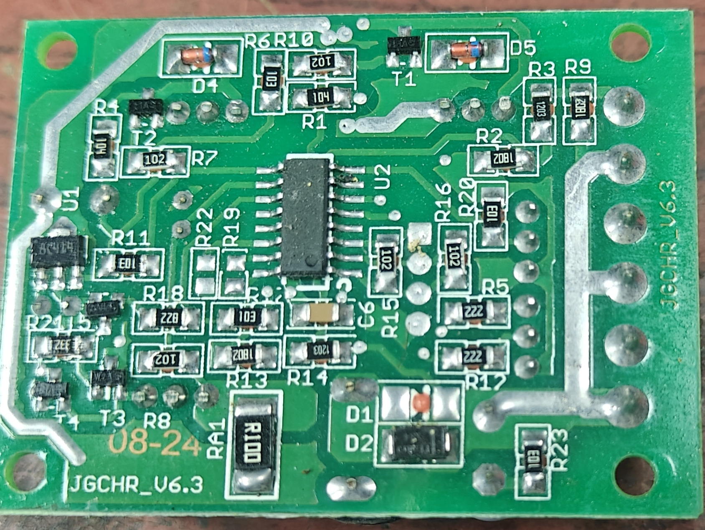
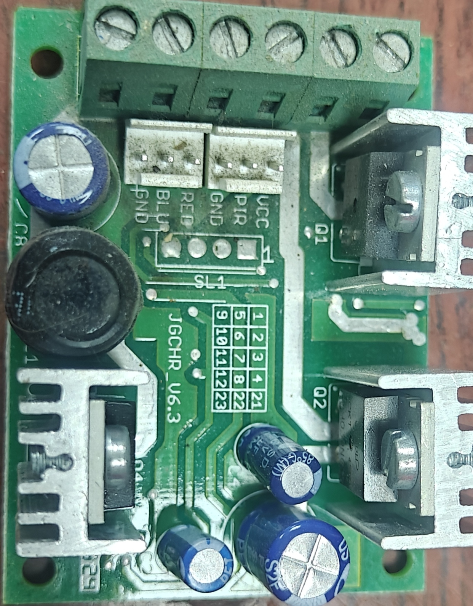
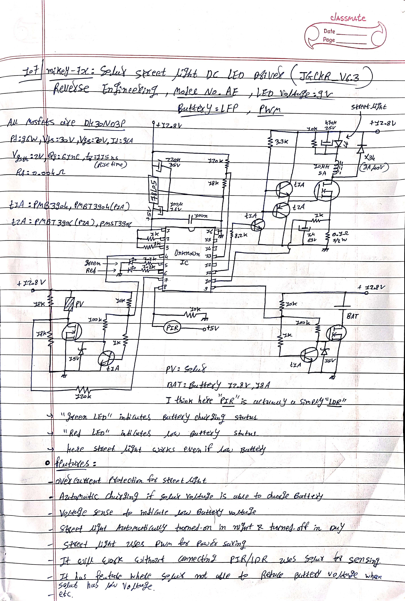
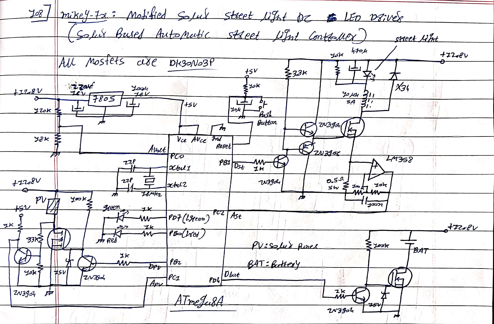

# Solar Street Light DC LED Driver ☀️🔋💡

This repository documents the reverse engineering of a commercial Solar Street Light DC LED Driver (Model No. AE / JGCHR_V6.3) and the subsequent development of a highly improved, open-source, custom microcontroller-based replacement using the **ATmega8A**. 

This project is ideal for hardware hackers, DIY electronics enthusiasts, and engineers looking to repair, understand, or upgrade commercial solar lighting systems with intelligent, programmable charge and lighting control.

---

## Table of Contents
* [Project Overview](#project-overview)
* [Part 1: The Original Circuit (Reverse Engineered)](#part-1-the-original-circuit-reverse-engineered)
* [Part 2: The Modified Custom Circuit (ATmega8A)](#part-2-the-modified-custom-circuit-atmega8a)
* [Key Improvements](#key-improvements)
* [Firmware Details and Pin Mapping](#firmware-details-and-pin-mapping)
* [Usage and Setup Instructions](#usage-and-setup-instructions)
* [License](#license)

---

## Project Overview
This project replaces the proprietary, unmarked controller of a standard commercial solar street light driver with an ATmega8A. By utilizing the existing high-power MOSFETs and power stages but swapping the logic center, the driver gains precision current sensing, software-debounced twilight switching, and a much safer, customizable battery charging loop for 12.8V LFP batteries.

---

## Part 1: The Original Circuit (Reverse Engineered)

The original commercial driver (PCB marking: `JGCHR_V6.3`) operates as an automatic solar street light controller designed for a 12.8V Lithium Iron Phosphate (LiFePO4/LFP) battery and a 9V LED fixture.

Here is the physical driver images which i reverse engineered 

Here is reverse engineered circuit 

### Hardware Overview
* **Core Controller:** An unknown/unmarked 14-pin IC (likely a custom ASIC or locked microcontroller).
* **Power Regulation:** Uses a standard `7805` linear voltage regulator to supply 5V to the logic circuitry.
* **Switching Components:** Relies heavily on **DH30N03P** N-Channel MOSFETs (30V, 96A) for managing the Photovoltaic (PV) input, Battery (BAT) charging, and LED driving.
* **Inductor:** Features a toroidal inductor (100µH, 5A) for the DC LED driver circuit.

Here is modified circuit diagram 

### Original Features and Capabilities
* **Auto Day/Night Sensing:** Uses the Solar Panel (PV) voltage to detect daylight, eliminating the strict need for external LDRs (though external PIR/LDR pin headers exist). 
* **Overcurrent Protection:** Hardware-based protection for the street light output.
* **Automatic Charging:** Routes PV power to the battery when solar voltage is sufficient.
* **Voltage Sensing:** Monitors battery voltage to detect and indicate low battery states.
* **LED Indicators:** * **Green LED:** Indicates battery charging status.
  * **Red LED:** Indicates low battery status.
* **Power Saving:** Utilizes PWM (Pulse Width Modulation) for driving the street light efficiently.

---

## Part 2: The Modified Custom Circuit (ATmega8A)

To bypass the limitations of the unknown proprietary IC, the circuit was completely redesigned around the highly accessible **ATmega8A** microcontroller. This allows for absolute control over the charging algorithms, twilight thresholds, and LED dimming behavior.

### Hardware Overview
* **Microcontroller:** **ATmega8A** running on the internal oscillator.
* **Current Sensing:** Integrated an **LM358 Op-Amp** along with a 0.5Ω (5W) shunt resistor. This amplifies the current signal (gain ≈ 11 via 100k/10k feedback loop) to feed into the ATmega8A's ADC for highly precise overcurrent protection.
* **MOSFETs:** Retains the high-power **DH30N03P** MOSFETs from the original design.
* **Voltage Dividers:** Utilizes 120kΩ/18kΩ resistor dividers to safely step down PV and Battery voltages for the ATmega8A's 5V ADC pins.

### Custom Capabilities
* **Programmable Twilight Timer:** Includes a 5-second software debounce timer. The light will not flicker during brief changes in light (e.g., a passing car's headlights or temporary shadows).
* **Intelligent Charge Loop:** Configured to cut off charging at **14.4V** to protect the battery and resume charging when the voltage naturally drops below **13.5V**.
* **High-Frequency Dimming:** Uses Timer1 Fast PWM (600Hz at 80% duty cycle) to drive the LED efficiently without visible flicker.
* **Digital Overcurrent Protection:** Continuously polls the LM358 amplified current signal. If the current exceeds **5.0A**, the MCU forces the LED off and blinks the Red LED as an error code.

---

## Key Improvements

| Feature | Original (Proprietary IC) | Modified (ATmega8A) |
| :--- | :--- | :--- |
| **Control Logic** | Fixed / Hardcoded | Fully open-source & reprogrammable via Arduino IDE |
| **Current Sensing** | Basic hardware limits | Amplified via LM358 for high precision ADC reading |
| **Twilight Sensing** | Prone to flickering on threshold | 5-Second debounced state-machine |
| **PWM Control** | Fixed frequency/duty cycle | Tuned to 600Hz / 80% Duty Cycle (customizable) |
| **Overcurrent Handling**| Cuts power silently | Cuts power and blinks Red LED to indicate a fault |

---

## Firmware Details and Pin Mapping

The provided firmware is written in C++ using the Arduino framework, targeting the ATmega8A. 

### Microcontroller Pin Mapping

| ATmega8A Pin | Arduino Pin | Component | Function |
| :--- | :--- | :--- | :--- |
| **PB2** | `10` | Dpv | Digital OUT: Activates PV connection |
| **PC1** | `A1` | Apv | Analog IN: Senses PV voltage |
| **PB1 (OC1A)**| `9` | Dst | PWM OUT: Drives street light MOSFET |
| **PC2** | `A2` | Ast | Analog IN: Reads LM358 current sense |
| **PD4** | `4` | Dbat | Digital OUT: Activates Battery charge |
| **PC0** | `A0` | Avolt | Analog IN: Reads Battery voltage |
| **PD7** | `7` | Lgreen | Digital OUT: Charging Indicator LED |
| **PB0** | `8` | Lred | Digital OUT: Low Battery/Fault Indicator LED |

### Code Structure Logic
1. **Voltage Polling:** Uses a 10-sample averaging loop on the ADCs to ensure stable, noise-free readings for both battery and PV voltages.
2. **State Machine:** Employs boolean flags (`is_charging`, `street_light_on`, `battery_full`) to prevent loop blocking and ensure non-disruptive execution.
3. **Timer1 Hardware PWM:** Modifies ATmega registers (`TCCR1A`, `TCCR1B`, `ICR1`, `OCR1A`) directly to generate a specific 600Hz inverted PWM signal, freeing up the CPU from manually bit-banging the LED.

---

## Usage and Setup Instructions

### 1. Building the Circuit
* Use the provided hand-drawn schematic to route the LM358 and ATmega8A to the existing power stages.
* Ensure adequate heatsinking is maintained on the **DH30N03P** MOSFETs.
* Verify the resistor values in the voltage dividers (120kΩ / 18kΩ) to ensure voltages hitting the ATmega pins never exceed 5V.

### 2. Flashing the ATmega8A
1. Install **MiniCore** in the Arduino IDE Boards Manager to support the ATmega8A.
2. Select **ATmega8** as the board, and set the clock to **16mhz external**.
3. Connect your ATmega8A to an ISP Programmer (like a USBasp or an Arduino Uno configured as ArduinoISP).
4. Burn the Bootloader (to set the internal oscillator fuses).
5. Compile and upload the provided `led_driver.ino` file.

### 3. Deployment
1. Connect the **Battery First** (to allow the ATmega8A to boot and stabilize).
2. Connect the **LED Street Light** payload.
3. Connect the **Solar Panel (PV)** last.

---

## License

MIT License

Copyright (c) 2026 mikey-7x

Permission is hereby granted, free of charge, to any person obtaining a copy
of this software and associated documentation files (the "Software"), to deal
in the Software without restriction, including without limitation the rights
to use, copy, modify, merge, publish, distribute, sublicense, and/or sell
copies of the Software, and to permit persons to whom the Software is
furnished to do so, subject to the following conditions:

The above copyright notice and this permission notice shall be included in all
copies or substantial portions of the Software.

THE SOFTWARE IS PROVIDED "AS IS", WITHOUT WARRANTY OF ANY KIND, EXPRESS OR
IMPLIED, INCLUDING BUT NOT LIMITED TO THE WARRANTIES OF MERCHANTABILITY,
FITNESS FOR A PARTICULAR PURPOSE AND NONINFRINGEMENT. IN NO EVENT SHALL THE
AUTHORS OR COPYRIGHT HOLDERS BE LIABLE FOR ANY CLAIM, DAMAGES OR OTHER
LIABILITY, WHETHER IN AN ACTION OF CONTRACT, TORT OR OTHERWISE, ARISING FROM,
OUT OF OR IN CONNECTION WITH THE SOFTWARE OR THE USE OR OTHER DEALINGS IN THE
SOFTWARE.
